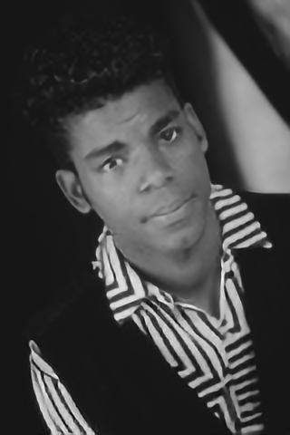
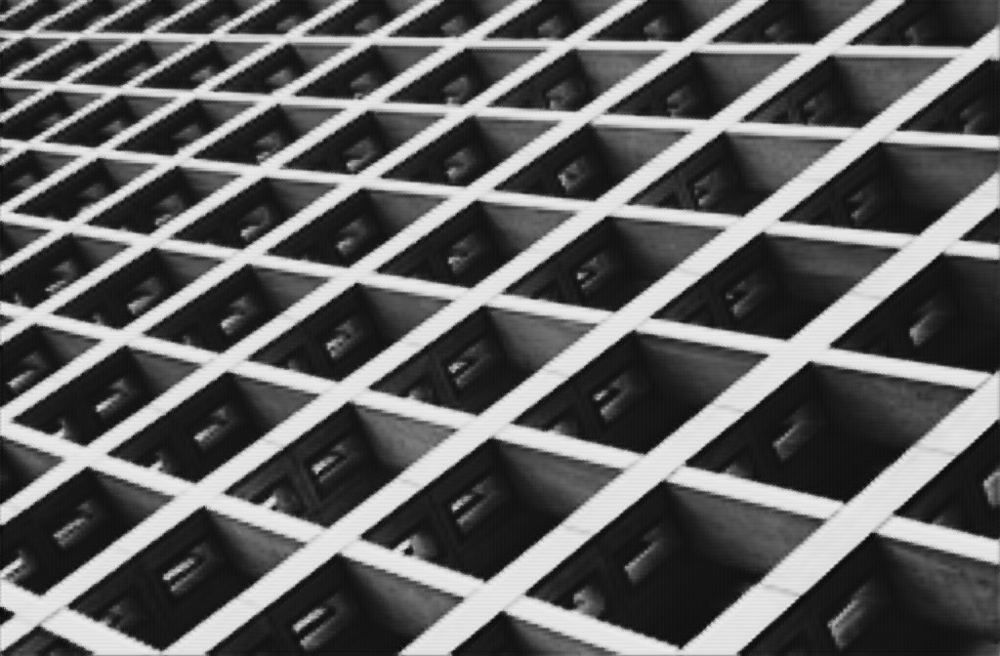
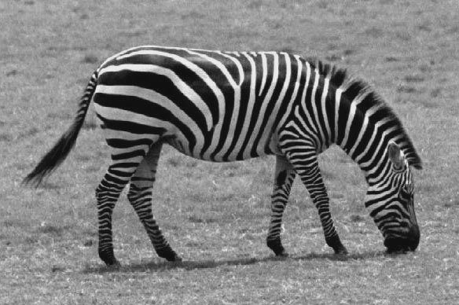

# Residual-Channel-Attention-Network
Unofficial Tensorflow implementation of "Image Super-Resolution Using Very Deep Residual Channel Attention Networks", ECCV 2018, [[arXiv]](https://arxiv.org/abs/1807.02758) 

## Train
1. Training Dataset is 800 training + 100 validtion images of [DIV2K dataset](https://data.vision.ee.ethz.ch/cvl/DIV2K/).The TFRecords for the same and npz files of the benchmark dataset can be found in the [drive link](https://drive.google.com/drive/folders/1HD3aXpLaJnctOF52N2WQZT5Lto-tA-nf?usp=sharing).

2. Maintain the following Directory structure


3. cd to `code`. Specify the scale of upsampling by '--scale'. Default value is 4. 

4. Run ```python3 training.py ``` 

## Inference
Run ```python3 infer.py ``` . The output will be stored in `results`.

## Evaluation (NOTE : THIS REQUIRES MATLAB)
1. cd to eval

2. Run `./matlab_eval.sh`

## Sample Results for x4 upsampling
|Ground Truth | Predicted|
-|-|
||
||
||

All the results are in Y channel. We can perform Bicubic interpolation in Cr and Cb channels and merge with the predicted Y channel. 
